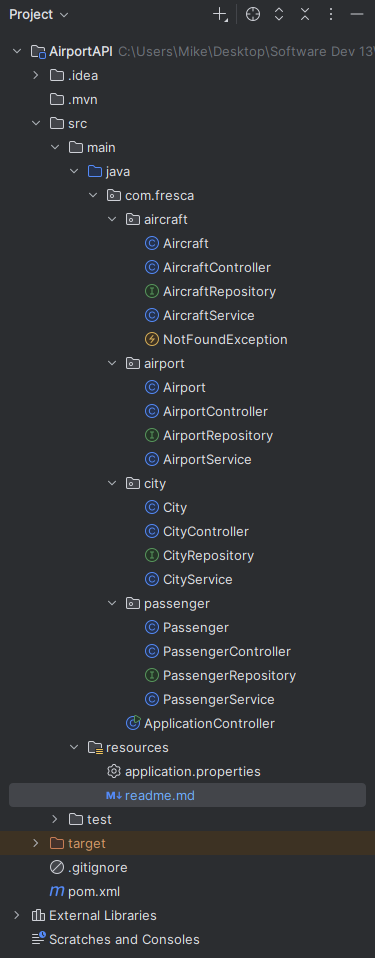

# Flight Management API

A RESTful API built with Spring Boot for managing cities, airports, passengers, and aircraft.
Technology Stack

- Java 17+
- Spring Boot 3.x
- Spring Data JPA
- MySQL 8.x
- Maven

### Project Structure

### Database Schema

#### Entities
- City: id, name, state, population
- Airport: id, name, code, city_id (FK)
- Passenger: id, firstName, lastName, phoneNumber, city_id (FK)
- Aircraft: id, type, airlineName, numberOfPassengers

#### Relationships
- City (1) → (Many) Airports
- City (1) → (Many) Passengers
- Passenger (Many) ↔ (Many) Aircraft
- Aircraft (Many) ↔ (Many) Airports

### Database Setup

###### SQL
* CREATE DATABASE flight_db;

2. Configure Application

###### edit [application.properties](application.properties)
spring.datasource.username=YOUR_USERNAME
spring.datasource.password=YOUR_PASSWORD

The API will start on http://localhost:8080

### API Endpoints
#### Cities

- POST /cities - Create city
- GET /cities - Get all cities
- GET /cities/{id} - Get city by ID
- PUT /cities/{id} - Update city
- DELETE /cities/{id} - Delete city

#### Airports

- POST /airports?cityId={id} - Create airport
- GET /airports - Get all airports
- GET /airports/{id} - Get airport by ID
- GET /airports/with-city - Get airports with city info
- PUT /airports/{id} - Update airport
- DELETE /airports/{id} - Delete airport

#### Passengers

- POST /passengers?cityId={id} - Create passenger
- GET /passengers - Get all passengers
- GET /passengers/{id} - Get passenger by ID
- GET /passengers/{id}/aircraft - Get passenger's aircraft
- POST /passengers/{passengerId}/aircraft/{aircraftId} - Link passenger to aircraft
- PUT /passengers/{id} - Update passenger
- DELETE /passengers/{id} - Delete passenger

#### Aircraft

- POST /aircraft - Create aircraft
- GET /aircraft - Get all aircraft
- GET /aircraft/{id} - Get aircraft by ID
- GET /aircraft/{id}/airports - Get aircraft's airports
- POST /aircraft/{aircraftId}/airports/{airportId} - Link aircraft to airport
- PUT /aircraft/{id} - Update aircraft
- DELETE /aircraft/{id} - Delete aircraft

### Testing

Use Postman to test all endpoints. Follow the testing guide to build data step by step.

### Contributors

- Michael Barney
- Joey Thomas
- Brandon Pike